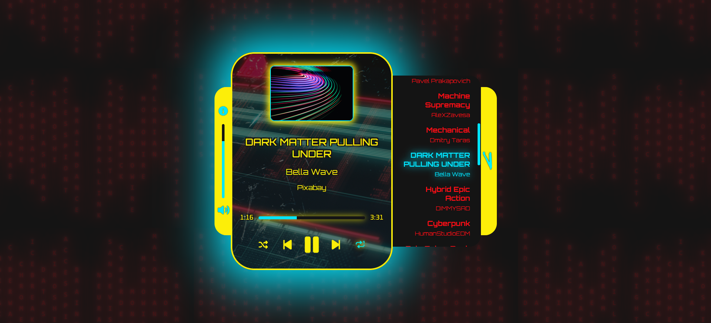

# CYBRPNK Music Player

A Cyberpunk 2077-inspired music player, built with HTML, CSS, JavaScript, and JSON.

A responsive player featuring custom playback controls, playlist management, and keyboard controls.

## Features

- Play, pause, next, and previous playback controls
- Shuffle playlist
- Repeat playlist and repeat track modes
- Volume control and mute functionality
- Live playback progress and track duration
- Track seeking control
- Dynamic track info and album artwork
- Scrollable track queue
- Clickable track selection
- Keyboard shortcuts
- Accessible credits dialog
- Responsive and animated Cyberpunk 2077-inspired UI
- Reduced-motion support

## Preview

## Credits & Licences

### Artwork & Music Credits:

- Artwork source: [Unsplash](https://unsplash.com/) - [licence](https://unsplash.com/license).
- Music source: [Pixabay](https://pixabay.com/music/) - [licence](https://pixabay.com/service/license-summary/).

### Inspiration:

Inspired by [Cyberpunk 2077](https://www.cyberpunk.net/gb/en/) and features imagery from [CD Projekt Red](https://www.cdprojektred.com/en).

---

This website is a non-commercial fan project created for educational and portfolio purposes.

Created by [`<lexiCodes/>`](https://github.com/nihilistic-lex)